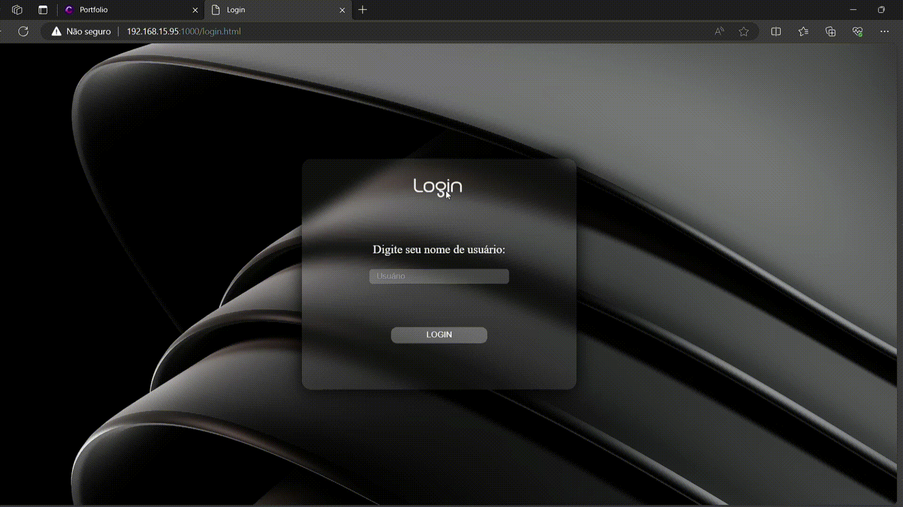

To run this project, set your current IPv4 address in the 'servidor.cjs' file. Also, set the same IPv4 in the 'script-login.js' file.
Ps: to run this project is necessary to install express framework.
Then run 'node servidor.cjs' in the terminal.

    

